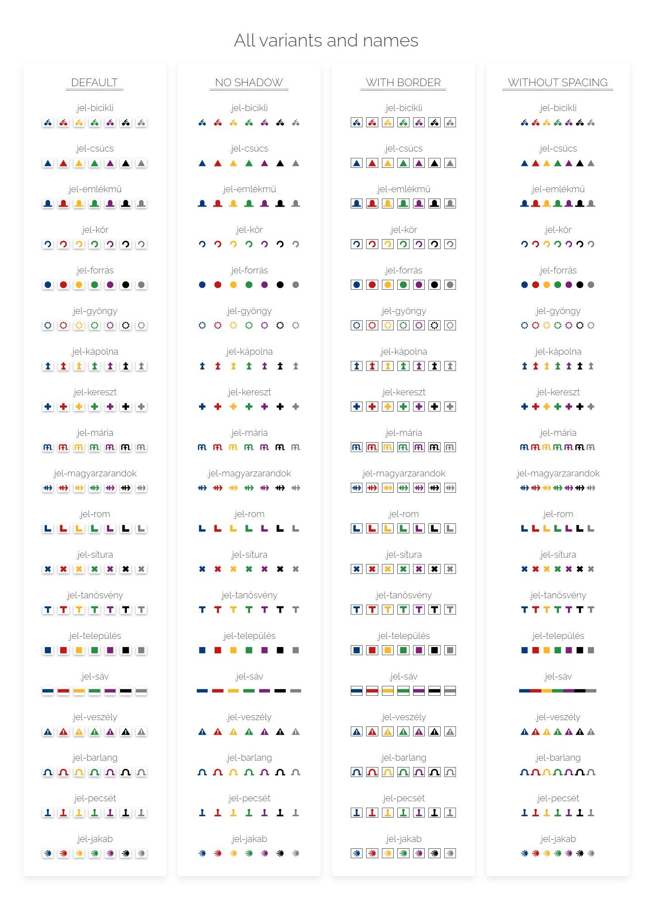

<p align="center">
<br><br>
<a target="_blank" href="https://github.com/pistika/turistajelek"></a>
</p>

<h2 align="center" align="center">Túristajelek, Hungarian Trail Signs</h2>
<p align="center">Add trail signs to your html content. These are small inline SVG-s that are added to your content with a single CSS file.<br><br>Just add a few classes and have all the signs in all the colors that you'd ever need.<br><br><a href="https://pistika.github.io/turistajelek/" target="_blank">Check it out here!</a></p>

<!-- GETTING STARTED -->
### Usage

```
1. Download the *-latest.css or *-latest.min.css file from GitHub
2. Link it in your <head>
3. Use the classes below
4. Profit
```
  
<p>A single CSS file that contains the SVG text content and uses the :before pseudo selector and the content property to insert these SVGs. No further requests to file anywhere.<br>
All SVGs are white and have negative space / cutout in them, making some parts transparent. These holes reveal the background color underneath, so any color can be used to insert these signs, no need to have multiple versions of the same sign just to have different colors.</p>
  
  
### Example

This is a basic example, it will insert a blue line/stripe sign where it is.

`<i class="jel jel-line jel-color-blue"></i>` -> 

```
The basic code must contain 3 class names:
- jel
    This is always required

- jel-color-{COLOR} or jel-szin-{COLOR}
    Ready to use color names:
        blue / kék / kek - rgb(0, 59, 128)
        red / piros - rgb(199, 23, 18)
        yellow / sarga / sárga - rgb(252, 184, 33)
        green / zold / zöld - rgb(36, 145, 64)
        purple / lila - rgb(125, 31, 122)
        black / fekete - rgb(0, 0, 0)
        grey / gray / szurke / szürke - rgb(128, 128, 128)

- jel-{SIGNNAME}
    All signs and names are listed at the end of the page
```
    
    
#### Signs   

| Icon | Name | Class(es) |
|------|------|-----------|
||Barlang / Cave|`.jel-barlang .jel-cave`|
||Kerékpár / Bike|`.jel-bicikli .jel-bike`|
||Csúcs / Summit|`.jel-csucs .jel-csúcs .jel-haromszog .jel-háromszög .jel-top .jel-triangle`|
||Emlékmű / Memorial|`.jel-emlek .jel-emlék  .jel-emlekmu .jel-emlékmű .jel-memorial .jel-monument`|
||Forrás / Source|`.jel-forras .jel-forrás .jel-source`|
||Gyöngy / Pearl|`.jel-gyongy .jel-gyöngy .jel-pearl`|
||Jakab / Santiago|`.jel-jakab .jel-santiago .jel-pearl`|
||Kápolna / Chapel|`.jel-kapolna .jel-kápolna .jel-templom .jel-chapel .jel-temple`|
||Kereszt / Cross|`.jel-kereszt .jel-cross`|
||Kör / Circle|`.jel-kor .jel-kör .jel-pont .jel-circle .jel-round .jel-dot`|
||Mária / Maria|`.jel-maria .jel-mária`|
||Magyar Zarándokút / Hungarian Pilgrimage|`.jel-mz .jel-magyarzarandok .jel-hungarianpilgrim .jel-hp .jel-mzarandok .jel-hpilgrim`|
||Pecsét / Stamp|`.jel-pecset .jel-pecsét .jel-kód .jel-kod .jel-stamp .jel-code`|
||Rom / Ruin|`.jel-rom .jel-ruin`|
||Sítúra / Skitour|`.jel-situra .jel-sítúra .jel-ski .jel-skitour`|
||Tanösvény / Education|`.jel-tan .jel-tanosveny .jel-tanösvény .jel-edu .jel-education`|
||Település / Settlement|`.jel-telep .jel-telepules .jel-település .jel-settlement .jel-education`|
||Veszély / Danger|`.jel-veszely .jel-veszély .jel-vigyazz .jel-vigyázz .jel-danger .jel-warning`|
||Sáv / Line|`.jel-sav .jel-sáv .jel-vonal .jel-csik .jel-csík .jel-line .jel-band .jel-stripe`|
||Alapértelmezett, ismeretlen / Default, unknown| - |
  
  
#### Colors

| Color | Name | Class(es) |
|------|------|-----------|
||Kék / Blue|`.jel-kek .jel-kék .jel-blue`|
||Piros / Red|`.jel-piros .jel-red`|
||Sárga / Yellow|`.jel-sarga .jel-sárga .jel-yellow`|
||Zöld / Green|`.jel-zold .jel-zöld .jel-green`|
||Lila / Purple|`.jel-lila .jel-purple`|
||Fekete / Black|`.jel-fekete .jel-black`|
||Szürke / Gray|`.jel-szurke .jel-szürke .jel-gray .jel-grey`|    
    

#### Modifiers
```
- jel-nincsarnyek / jel-noshadow (class)
This will remove the CSS dropshadow from the sign

- jel-keret / jel-border (class)
This will add a smell color matching border to the sign

- jel-nincsterkoz / jel-nowhitespace (class)
Removes the spacing before and after the sign

- jel-kicsi / jel-sm / jel-small (class)
Smaller version. This will make the height 0.75em tall.

- jel-nagy / jel-big / jel-lg / jel-large (class)
Bigger version. This will make it 1.5em tall.

- any background CSS style property (attribute)
    style="background-color: teal;"
    style="background-color: rgba(12, 99, 200, 0.89);"
    style="background-image: linear-gradient(red, yellow);"
    Any valid CSS property value pair should work
```


<p align="center">

</p>

### Customizing

1. Download the -latest.scss
2. Modify to your needs
3. Build / compile
4. Profit

### Todos

- I know there are some missing signs, mostly region and event specific ones. I'll try to trace and update all of them as quickly as I'm able to.
    
    
## Contributing
I don't know how much will I maintain this thing, but if you think you have something to contribute:

1. Fork the Project
2. Create your Feature Branch (`git checkout -b changes/modifysomethingpls`)
3. Commit your Changes (`git commit -m 'Add some modifysomethingpls'`)
4. Push to the Branch (`git push origin changes/modifysomethingpls`)
5. Open a Pull Request
    
    
## License
pistika/turistajelek is licensed under the GNU Affero General Public License v3.0. See `LICENSE` for more information.